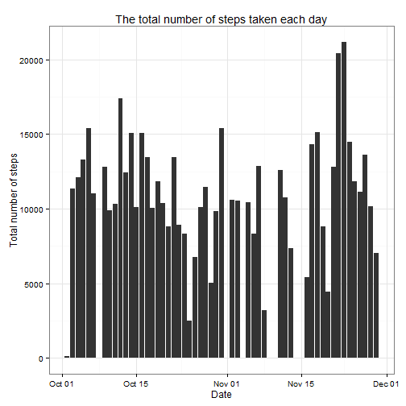
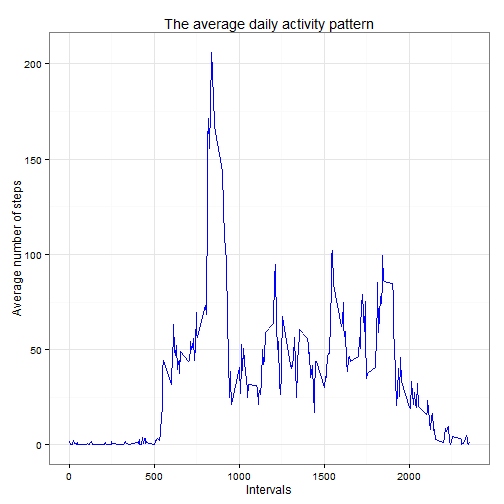
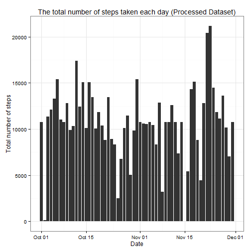
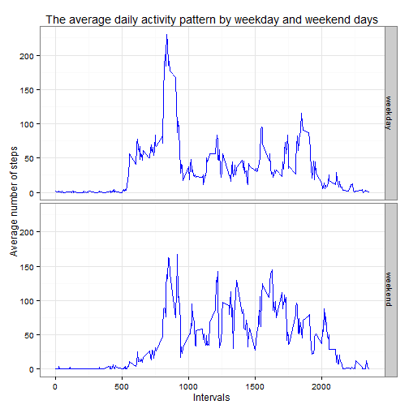

## Loading and preprocessing the data

We will download, unpack and load activity monitor dataset into R using the following code:


```r
## Downloading our dataset from the server
url <- "https://d396qusza40orc.cloudfront.net/repdata%2Fdata%2Factivity.zip"
tmpFile <- tempfile()
download.file(url, destfile = tmpFile)
## Loading and unzipping our dataset. We use colClasses argument to specify classes of the columns 
data <- read.csv(unzip(tmpFile), colClasses = c("numeric", "Date", "numeric"))
## Delete temporary file
unlink(tmpFile)
```
## What is mean total number of steps taken per day?
For this part of assignment we will ignore missing values in the dataset. 

Let's calculate the total number of steps taken per day.


```r
dataAggregate <- aggregate(steps ~ date, data, sum, na.action = na.omit)
```
Next we will make a histogram of the total number of steps taken each day.

```r
library(ggplot2)
qplot(x = date, y = steps, data = dataAggregate, geom = "histogram", stat = "identity") + 
        labs(x = "Date", y = "Total number of steps", title = "The total number of steps taken each day") +
        theme_bw() 
```

 

 The mean of the total number of steps taken per day

```r
 mean(dataAggregate$steps)
```

```
## [1] 10766.19
```

The median of the total number of steps taken per day


```r
 median(dataAggregate$steps)
```

```
## [1] 10765
```
 
## What is the average daily activity pattern?
 Let's look at a time series plot of the 5-minute interval (x-axis) and the average number of steps taken, averaged across all days (y-axis).

```r
dataInterval <- aggregate(steps ~ interval, data, mean)
ggplot(dataInterval, aes(x = interval, y = steps)) +
        geom_line(color = "blue") +
        labs(x = "Intervals", y = "Average number of steps", title = "The average daily activity pattern") +
        theme_bw()
```

 

Across all the days in the dataset this particular 5-minute interval, on average, contains the maximum number of steps

```r
dataInterval[which.max(dataInterval$steps),]
```

```
##     interval    steps
## 104      835 206.1698
```

## Imputing missing values
We can notice that there are a number of days/intervals where there are missing values (coded as NA). The presence of missing days may introduce bias into some calculations or summaries of the data. 

 Let's look at the total number of missing values in the dataset.

```r
 sum(is.na(data$steps))
```

```
## [1] 2304
```
 To fill in all of the missing values in the dataset we will use the mean for the 5-minute interval. We will create a new dataset that is equal to the original dataset but with the missing data filled in.

```r
dataFull <- data
missing <- which(is.na(data$steps))
for(i in missing) {
        dataFull$steps[i] <- dataInterval[which(dataInterval$interval == dataFull[i, "interval"]), "steps"]
}
```
Let's make a histogram of the total number of steps taken each day of the new dataset.

```r
dataFullAggregate <- aggregate(steps ~ date, dataFull, sum)
qplot(x = date, y = steps, data = dataFullAggregate, geom = "histogram", stat = "identity") + 
        labs(x = "Date", y = "Total number of steps", title = "The total number of steps taken each day (Processed Dataset)") +
        theme_bw() 
```

 

 The mean of the total number of steps taken per day of the processed dataset.

```r
 mean(dataFullAggregate$steps)
```

```
## [1] 10766.19
```

The median of the total number of steps taken per day of the processed dataset.


```r
 median(dataFullAggregate$steps)
```

```
## [1] 10766.19
```

We can see that the mean value from the estimates from the first part of the assignment does not differ from the processed dataset. But the median of the processed dataset differs from the original dataset by a non-significant amount. These facts can be explained by the method used to fill in missing values. The usage of mean values of 5-minute intervals to fill in missing values did not influence the mean value of the processed dataset.

## Are there differences in activity patterns between weekdays and weekends?
For this part we will use the dataset with the filled-in missing values. we will create a new factor variable in the dataset with two levels – "weekday"" and "weekend" indicating whether a given date is a weekday or weekend day.


```r
for (i in 1:dim(dataFull)[1]) {
        if(weekdays(dataFull$date[i], abbreviate = T) == "Sat" || weekdays(dataFull$date[i], abbreviate = T) == "Sun"){
                dataFull$wday[i] <- "weekend"
        } else {
                dataFull$wday[i] <- "weekday"
        }
}
dataFull$wday <- as.factor(dataFull$wday)
```

Next we will make a panel plot containing a time series plot of the 5-minute interval (x-axis) and the average number of steps taken, averaged across all weekday days or weekend days (y-axis).

```r
dataFullInterval <- aggregate(steps ~ interval + wday, dataFull, mean)
ggplot(dataFullInterval, aes(x = interval, y = steps)) + 
        facet_grid(wday ~ .) +
        geom_line(color = "blue") + 
        labs(x = "Intervals", y = "Average number of steps", title = "The average daily activity pattern by weekday and weekend days") +
        theme_bw()
```

 

